## KD-CNN 기반 경량 서비스메시를 활용한 클라우드 네이티브 침입탐지시스템

2026 전기 부산대학교 정보컴퓨터공학부 졸업과제 42조 DeepMesh

### 1. 프로젝트 배경

#### 1.1. 국내외 시장 현황 및 문제점

컨테이너와 쿠버네티스로 대표되는 클라우드 네이티브 아키텍처는 오늘날 서비스 배포의 사실상
표준입니다. 애플리케이션을 독립적으로 배포 가능한 마이크로서비스로 분해하고 이들이 네트워크
호출로 협력하는 MSA 구조가 보편화되면서, 서비스 사이를 오가는 내부 통신(east-west 트래픽)의
양과 복잡도도 함께 늘었습니다. 하나의 사용자 요청이 인증, 게시글, 댓글 같은 여러 서비스를
연쇄로 거치는 구조에서 이 내부 통신 경로는 그 자체가 새로운 공격 표면이 됩니다.

위협의 양상도 달라지고 있습니다. LLM 기반 도구의 확산으로 공격 자동화와 신종 공격의 생성
비용이 급격히 낮아졌고, 규칙에 의존하는 방어만으로는 대응이 어려운 제로데이 공격이 늘고
있습니다. 특히 공격자가 하나의 Pod를 침해한 뒤 클러스터 내부의 다른 Pod나 쿠버네티스 API로
접근을 넓혀 가는 측면 이동(Lateral Movement)은, 외부 경계 방어를 이미 통과한 뒤 내부에서 범위를
확산하는 공격이라 탐지가 특히 어렵습니다.

실제 사례도 있습니다. 클라우드와 컨테이너 환경을 겨냥해 온 위협 그룹 TeamTNT는 잘못 설정된
쿠버네티스 클러스터를 스캔하고 침해하여 약 5만 개의 IP를 감염시키는 웜 형태의 공격을
수행했습니다. 침해한 컨테이너를 발판으로 노출된 kubelet과 탈취한 서비스 어카운트 토큰을 이용해
클러스터 내부의 다른 자원으로 접근 범위를 확장했습니다[1].

**기존 서비스메시의 한계.** 서비스 간 통신을 제어하기 위해 Istio, Linkerd 같은 서비스메시가 널리
쓰입니다. 이들은 각 Pod에 사이드카 프록시를 주입해 애플리케이션 코드 변경 없이 통신을 가로채고
접근 제어, 최소 권한, mTLS 신원 검증을 제공합니다. 그러나 이 보안 모델은 관리자가 사전에 정의한
정적 정책을 검증하는 예방적 통제이지, 트래픽의 이상 행위를 학습해 탐지하는 침입탐지시스템이
아닙니다[2]. Linkerd의 인가 정책은 기본적으로 모든 트래픽을 허용하고 관리자가 CRD로 조건을
명시했을 때만 제한합니다[3].

그 결과 다음 두 경우가 사각지대로 남습니다.

- 이미 허용된 통신 경로를 그대로 이용하면서 프로토콜과 엔드포인트가 정상과 동일한 애플리케이션
  계층 공격
- 사전에 정의된 적 없는 제로데이 취약점을 악용하는 공격

침해된 Pod가 인가된 east-west 경로를 따라 확산되는 측면 이동은 통신 자체가 정책상 허용된 형태를
띠기 때문에, 정적 정책 기반 방어로는 막기 어렵습니다.

#### 1.2. 필요성과 기대효과

정책 검증이 아니라 **학습된 정상 분포에서의 이탈**을 기준으로 판정하는 탐지 계층이 서비스메시
안에 필요합니다. DeepMesh는 각 서비스 Pod의 사이드카가 outbound 트래픽을 세션 단위로 판정하고,
이상으로 본 트래픽을 교차 검증한 뒤 차단하거나 안전한 응답으로 교체합니다.

기대효과는 다음과 같습니다.

- **출발 지점에서의 억제** - 침해된 Pod에서 시작되는 측면 이동을 트래픽이 네트워크로 나가기 전에
  끊습니다. 목적지 쪽 방어에 의존하지 않습니다.
- **애플리케이션 무변경** - 사이드카 패턴이라 서비스 코드를 고치지 않습니다.
- **경량 배포** - 지식 증류로 1.23K에서 12.64K 파라미터 규모의 학생 모델을 사용해 Pod마다 탐지기를
  붙여도 자원 부담이 크지 않습니다. 추론 지연은 이미지당 0.36ms에서 1.13ms입니다.
- **오탐 억제** - 이상 판정이 곧바로 차단으로 이어지지 않고 replica 교차 검증을 한 단계 더 거치므로,
  학습 모델의 오탐이 서비스 중단으로 번지지 않습니다.

### 2. 개발 목표

#### 2.1. 목표 및 세부 내용

KD-CNN 기반 경량 AI 서비스메시를 개발하여 클라우드 네이티브 환경의 침입탐지시스템을 구현하는
것이 목표입니다. 각 서비스 Pod에 사이드카로 결합된 프록시가 outbound 트래픽을 가로채 세션
단위로 이상 여부를 판정하고, 이상으로 판정된 트래픽은 Control Plane 및 형제 Replica Pod와의 교차
검증을 거쳐 오탐을 걸러낸 뒤 차단(DROP)하거나 안전한 응답으로 교체(RELAY)합니다.

세부 구현 내용은 다음과 같습니다.

| 구분 | 내용 |
|---|---|
| Traffic Handler | iptables로 outbound 트래픽을 프록시로 우회시키고, 5-tuple 기준으로 패킷을 세션으로 묶습니다. 판정 결과에 따라 FORWARD, DROP, RELAY를 집행합니다 |
| Traffic Converter | 세션 단위 패킷을 20차원 의미 기반(semantic) 벡터로 인코딩하고 5개를 쌓아 세션 이미지로 만듭니다 |
| Anomaly Detector | 세션 이미지를 KD-CNN 인코더에 통과시켜 임베딩을 얻고 OCSVM으로 정상 여부를 판정합니다 |
| Request Verifier | 요청 시그니처가 같은 서비스의 다른 replica에서 관측된 적 있는지 확인합니다 |
| Pod Info Provider | 클러스터의 Pod 정보를 주기적으로 수집해 각 프록시에 형제 Pod 주소록을 배포합니다 |
| 모니터링 대시보드 | 판정 결과를 실시간 토폴로지, 이벤트 피드, 통계로 시각화합니다 |
| 실험 파이프라인 | 정상 트래픽 수집, 지식 증류 학습, 아키텍처 스윕, 재보정, 성능 평가를 수행합니다 |

#### 2.2. 기존 서비스 대비 차별성

**기존 서비스메시와의 차별성**

| 항목 | Istio, Linkerd | DeepMesh |
|---|---|---|
| 판정 근거 | 관리자가 정의한 정적 정책 | 학습된 정상 트래픽 분포에서의 이탈 |
| 미정의 공격 | 정책에 없으면 통과 | 정상 분포를 벗어나면 탐지 |
| 허용 경로 내 공격 | 탐지 불가 | 세션 단위 표현으로 탐지 |
| 오탐 처리 | 해당 없음 | replica 교차 검증으로 2단계 판정 |
| 집행 위치 | 양방향 정책 검증 | outbound 출발 지점 |

**선행 연구와의 차별성.** 학습 기반 탐지를 서비스메시에 결합하려는 시도는 선행 연구에서 이미
이루어졌습니다[8], [10]. 다만 선행 연구의 주요 탐지 대상인 쿠버네티스 API 이탈 공격은 프로토콜과
목적지만으로도 정상 트래픽과 구분됩니다. 본 클러스터에서 정상 트래픽을 실측한 결과 서비스 간
통신은 모두 평문 HTTP(:8080)였고 :443 TLS는 나타나지 않았습니다. 그 조건에서 얻은 탐지 성능만으로는
모델의 변별력을 입증하기 어렵습니다. 본 연구는 세 가지로 이 공백을 보완했습니다.

1. **정상과 동일한 프로토콜, 엔드포인트를 쓰는 애플리케이션 계층 공격을 탐지 대상에
   추가**했습니다. 개별 패킷 형식만으로는 정상과 구분되지 않으므로 연속된 패킷을 함께 검토합니다.
2. **표현 방식을 바꿔 대조 실험을 수행**했습니다. 선행 연구의 원시 바이트(raw-byte) 표현과 본
   연구의 의미 기반(semantic) 표현을 같은 조건에서 비교해, 분리도와 재보정 안정성뿐 아니라
   메모리와 추론 지연에서도 semantic이 우수함을 정량적으로 확인했습니다.
3. **서비스별로 컨버터와 모델 크기를 분리**하고 FPR 예산 기반 재보정을 적용해 재현성을
   확보했습니다.

#### 2.3. 사회적 가치 도입 계획

**침해 피해가 번지는 범위를 줄입니다.** 오늘날 서비스 장애와 개인정보 유출은 한 지점의 침해가
내부로 확산되면서 규모가 커집니다. DeepMesh는 측면 이동을 출발 지점에서 끊어, 하나의 Pod가
뚫리더라도 그 영향이 클러스터 전체와 이용자에게 미치지 않도록 합니다.

**이미 돌아가는 서비스를 고치지 않고 보호합니다.** 사이드카 패턴이라 애플리케이션 코드를 건드리지
않습니다. 보안을 이유로 서비스를 다시 개발할 수 없는 환경에서도 탐지 계층만 얹을 수 있습니다.

**공격 표본 없이 유지됩니다.** 정상 트래픽만으로 학습하므로 새로운 공격이 나올 때마다 그 표본을
모아 재학습할 필요가 없습니다. 시그니처를 계속 갱신해야 하는 규칙 기반 방어와 달리, 정상 분포에서
벗어나는지를 기준으로 알려지지 않은 공격까지 다룹니다. 보안 인력이 상시 대응하기 어려운 조직일수록
이 차이가 의미를 갖습니다.

**GPU 없이 동작해 자원 소모가 작습니다.** 탐지기는 Pod마다 붙기 때문에 모델 하나의 비용이 서비스
수만큼 곱해집니다. 수백만 파라미터와 GPU 추론 환경을 전제하는 기존 딥러닝 이상탐지와 달리 1.23K에서
12.64K 파라미터로 CPU에서 동작하고, 의미 기반 표현으로 세션 이미지를 74배 줄여 학습 단계의 메모리와
연산량도 함께 낮췄습니다.

### 3. 시스템 설계

#### 3.1. 시스템 구성도

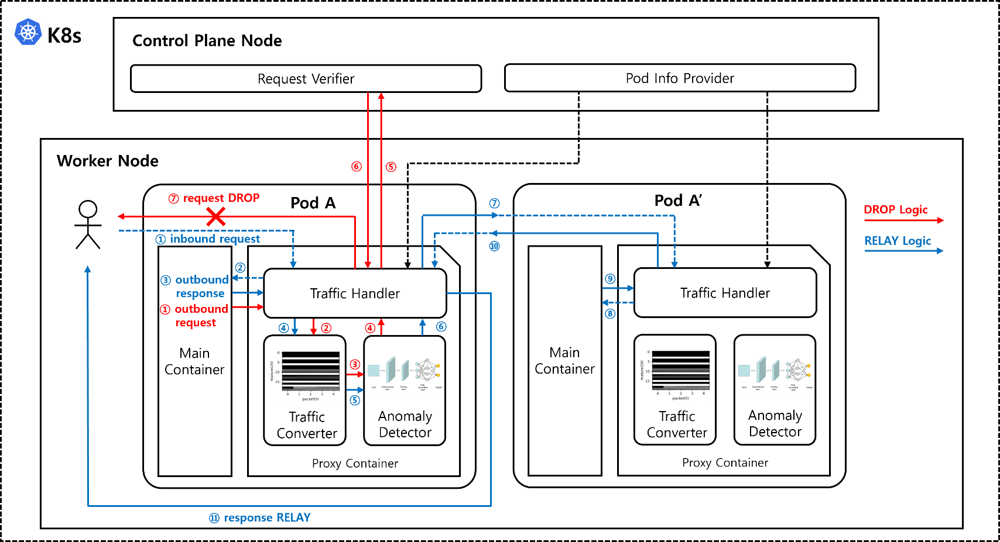

Control Plane 노드에서 Request Verifier와 Pod Info Provider가 호스트 프로세스로 동작하고, Worker
노드의 각 서비스 Pod에는 Main Container 옆에 Proxy Container가 사이드카로 결합됩니다. 모든 Pod는
교차 검증의 기준이 되는 Replica Pod를 함께 둡니다.

붉은 선이 요청 차단(DROP) 경로, 푸른 선이 응답 대체(RELAY) 경로입니다. 두 경로의 단계별 설명은
4.1에 있습니다.

프록시 컨테이너는 세 모듈로 구성됩니다.

- **Traffic Handler** - Main Container가 주고받는 트래픽을 가로채고, 어느 주소에서 어느 주소로 가는
  통신인지를 기준으로 패킷을 하나의 세션으로 묶습니다. 탐지 결과에 따라 FORWARD, DROP, RELAY 중
  하나를 집행합니다.
- **Traffic Converter** - 세션 단위로 모인 패킷을 Anomaly Detector가 입력받는 세션 이미지로
  변환합니다.
- **Anomaly Detector** - 세션 이미지를 입력받아 정상과 이상 여부를 판단합니다.

Pod 자신을 기준으로 트래픽은 inbound와 outbound로 나뉘고 각각 요청과 응답이 있습니다. 본 시스템은
이미 침해된 Pod에서 공격이 확장되는 측면 이동을 막는 것이 목적이므로 **outbound 트래픽만**
검사합니다. 트래픽의 시작 지점에서 검사하므로 outbound만 보아도 내부 트래픽 전체가 덮입니다.

#### 3.2. 사용 기술

| 구분 | 기술 스택 |
|---|---|
| 소프트웨어 형상관리 | GitHub |
| 컨테이너 오케스트레이션 | Kubernetes v1.33.13, containerd 2.2.1, Calico v3.30.5 |
| VM 프로비저닝 | Vagrant, KVM/libvirt, Ubuntu 24.04.2 LTS |
| 컨테이너 | Docker |
| MSA 백엔드 | Spring Boot 3.5.14, Java 17, JPA |
| MSA 프론트엔드 | React 19.2.6, TypeScript 5.9.3, Vite 8.0.12, Nginx |
| 사이드카 프록시 | Python 3, aiohttp 3.10.11, iptables |
| 탐지 런타임 | PyTorch 2.8.0+cpu, scikit-learn 1.6.1, NumPy 2.0.2, joblib 1.5.3 |
| Control Plane | Python 3, aiohttp, kubernetes client 29+ |
| 대시보드 백엔드 | Spring Boot 3.5.14, Java 17, SSE |
| 대시보드 프론트엔드 | React 19.2.6, TypeScript, @xyflow/react 12.10.0, Recharts 3.7.0 |
| 데이터베이스 | MySQL 8.0 |
| 트래픽 생성 | Locust, mitmproxy |
| 모델 학습 | PyTorch, Knowledge Distillation, One-Class SVM |

### 4. 개발 결과

#### 4.1. 전체 시스템 흐름도

판정 이후의 처리는 트래픽 방향에 따라 갈라집니다. 두 경우 모두 Traffic Handler가 트래픽을
가로채고 Traffic Converter가 세션 이미지를 만들어 Anomaly Detector가 판정하는 과정까지는 같으며,
정상으로 판정되면 추가 검증 없이 전달됩니다(benign 판정 후 FORWARD).

| 구분 | Outbound Request | Outbound Response |
|---|---|---|
| 2차 검증 방식 | Request Verifier에 시그니처 질의 | 형제 Pod의 참조 응답과 본문 비교 |
| 검증 근거 | 과거의 관측 이력 | 같은 시점 다른 replica의 실제 내용 |
| 통과 시 | cleared 판정 후 FORWARD | cleared 판정 후 FORWARD |
| 실패 시 | DROP (요청 폐기) | RELAY (응답 교체) |

**요청 트래픽의 DROP 경로**

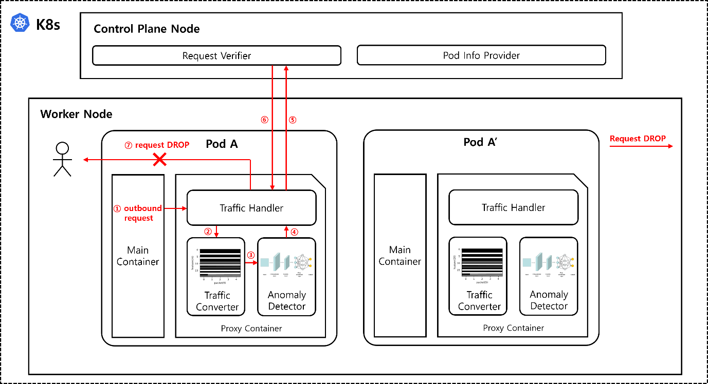

Main Container가 내보내는 요청은 iptables 규칙에 의해 Traffic Handler로 우회됩니다(①). Handler는
이를 Converter에 전달해(②) 세션 이미지를 만들고 Detector로 보내(③) 판정을 받습니다(④).

정상이면 그대로 전달됩니다. 이상으로 판정된 경우에만 Handler가 요청에서 ID나 payload 같은 가변
요소를 제거하고 구조만 남긴 시그니처를 만들어 Request Verifier에 검증을 요청합니다(⑤). Verifier는
각 Pod의 프록시가 보내온 시그니처를 서비스 단위로 누적해 두고, 동일한 시그니처가 그 서비스의 다른
replica에서도 관측된 적 있는지 확인해 응답합니다(⑥). 정상 동작이라면 같은 코드를 실행하는 다른
replica에서도 동일한 요청이 나타나는 반면, 침해된 Pod가 단독으로 수행하는 정찰이나 측면 이동
시도는 그 Pod에서만 관측되기 때문입니다.

관측 이력이 없어 검증에 실패하면 요청은 폐기됩니다(⑦). 이때 Handler는 목적지로 연결을 열기 전에
처리를 종료하므로 **해당 요청이 네트워크로 나가는 일 자체가 발생하지 않습니다.**

**응답 트래픽의 RELAY 경로**

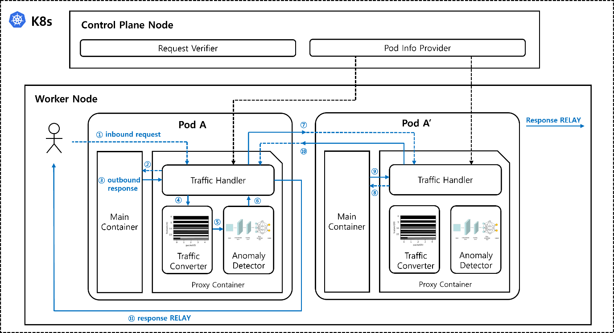

외부에서 들어온 요청은 검사 없이 Main Container로 전달되고(①②), 검사 대상은 그에 대한
응답입니다(③). 응답도 Converter와 Detector를 거쳐 판정됩니다(④⑤⑥).

이상으로 판정되면 Handler는 Pod Info Provider가 미리 배포해 둔 형제 Pod 주소록으로 같은 서비스의
다른 replica에 동일한 요청을 보냅니다(⑦). 주소록은 판정 시점에 조회하는 것이 아니라 미리 배포된
것이므로 검증 과정에서 Control Plane과의 통신은 발생하지 않습니다. replica는 이를 일반 inbound
요청으로 처리해 응답을 돌려줍니다(⑧⑨⑩).

Handler는 확보한 참조 응답의 본문을 원래 응답과 비교하여, 같으면 오탐으로 보고 원래 응답을
전달하고, 다르면 해당 Pod만 오염된 내용을 내보내고 있다고 판단해 참조 응답으로 교체합니다(⑪).

이 방식은 형제 Pod에서 요청을 재실행하므로 서버 상태를 바꾸지 않는 안전 메서드(GET, HEAD,
OPTIONS)에만 적용됩니다. 응답을 통한 정보 유출은 대부분 조회 요청의 응답에서 발생하므로 이 제약이
실질적인 탐지 공백으로 이어지지는 않습니다.

#### 4.2. 기능 설명 및 주요 기능 명세서

**트래픽 이상 탐지 (Traffic Converter + Anomaly Detector)**

- 설명: 세션 단위로 묶인 패킷을 20차원 의미 기반 벡터로 인코딩하고 5개를 쌓아 이미지를 만든 뒤,
  KD-CNN 인코더와 OCSVM으로 정상 여부를 판정합니다. 새 패킷이 올 때마다 가장 오래된 벡터를 빼고
  새 벡터를 넣는 슬라이딩 윈도우로 이미지를 갱신합니다.
- 입력: 세션으로 묶인 패킷 5개
- 출력: 정상과 이상 판정, 이상 점수(decision score)

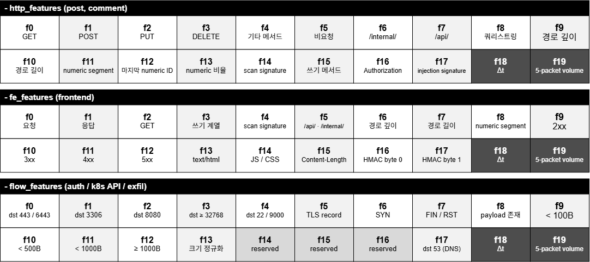

같은 20차원이라도 서비스 성격에 따라 채우는 방식이 다릅니다.

| 표현 | 대상 서비스 | 신호의 성격 |
|---|---|---|
| `http_features` | post, comment | 메서드, 경로 접두, 숫자 세그먼트, 스캔 시그니처 등 요청 파싱 위주 |
| `fe_features` | frontend | 요청에 더해 상태코드, Content-Type, 응답 본문의 HMAC 지문 2바이트 |
| `flow_features` | auth, 공격 의심 포트로의 egress | payload 미파싱, 목적지 포트, TCP 플래그, 크기 구간, TLS 레코드 여부 |

목적지 포트가 443, 6443, 22, 9000 중 하나이면 payload를 파싱하지 않고 `flow_features`로
이미지화합니다. 정상 Pod가 쓸 이유가 없으면서 침해된 Pod가 원격 접근(22)이나 C2 채널(9000)에 흔히
쓰는 포트이므로 egress 자체가 이상 신호의 근거가 됩니다. 다만 이 규칙들은 **특징을 추출하는 규칙일
뿐 차단 규칙이 아닙니다.** 최종 판정은 특징의 조합이 학습된 정상 분포에서 얼마나 벗어나는지를 CNN과
OCSVM이 계산한 결과로 정해집니다.

**모델 경량화 (Knowledge Distillation)**

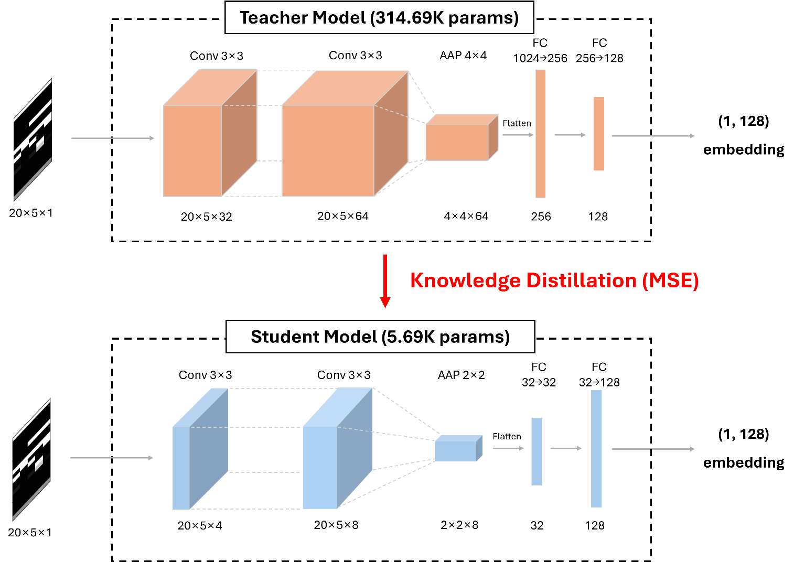

- 설명: 314.69K 파라미터의 Teacher 모델을 정상 트래픽만으로 자기지도 대조학습시킨 뒤, 그 임베딩을
  MSE로 따라 배우도록 Student 모델을 증류합니다. 두 모델 모두 20x5x1 세션 이미지를 128차원 임베딩으로
  내보내며, Student는 1.23K에서 12.64K 파라미터로 줄어듭니다.
- 입력: 20x5x1 세션 이미지
- 출력: 128차원 임베딩 벡터

**요청 교차 검증 (Request Verifier)**

- 설명: 이상으로 판정된 요청의 시그니처가 같은 서비스의 다른 replica에서 관측된 적 있는지
  확인합니다. 시그니처는 ID나 payload 같은 가변 요소를 제거하고 구조만 남긴 형태입니다.
- 입력: 서비스명, Pod IP, 요청 시그니처
- 출력: 허용 여부와 근거 (관측 이력 유무)

**Pod 주소록 배포 (Pod Info Provider)**

- 설명: 쿠버네티스 API로 네임스페이스의 Pod 정보를 주기적으로 수집해, 각 프록시에 같은 서비스의
  형제 Pod 주소록을 push합니다.
- 입력: 쿠버네티스 API의 Pod 목록 (기본 10초 주기)
- 출력: 각 사이드카에 전달되는 서비스별 replica 주소록

**모니터링 대시보드**

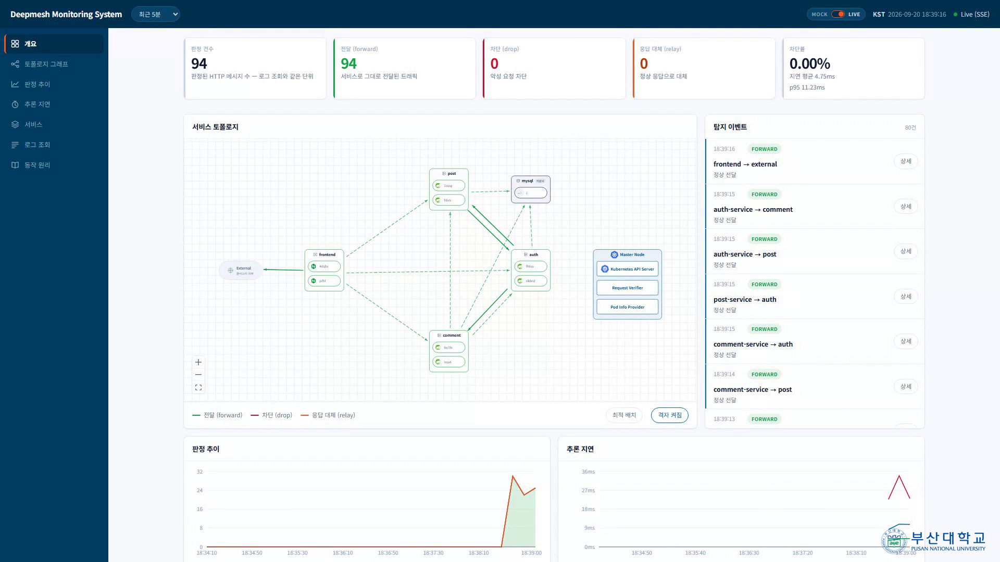

- 설명: 사이드카가 보낸 텔레메트리 이벤트를 수집해 실시간 토폴로지, 판정 추이, 추론 지연, 서비스별
  통계, 로그 조회로 시각화합니다. 실시간 갱신은 SSE로 처리합니다.
- 입력: 사이드카의 텔레메트리 이벤트 (5-tuple, 판정, 이상 점수, 임계값, 지연)
- 출력: 토폴로지 그래프, 탐지 이벤트 피드, 시계열 통계, CSV 내보내기

토폴로지의 간선 색은 판정을 나타냅니다. 전달(forward), 차단(drop), 응답 대체(relay) 세 가지이며,
정상 판정(benign)과 교차 검증 통과(cleared)는 둘 다 목적지로 전달되므로 forward로 묶어
표시합니다.

**공격 시나리오**

측면 이동의 여러 국면을 포괄하도록 시나리오를 구성했고, 각각 MITRE ATT&CK 기법에 대응됩니다[9].

| 시나리오 | 침해 서비스 | 공격 내용 | MITRE | 방향 | 대응 |
|---|---|---|---|---|---|
| k1 | 전 서비스 | K8s API 정찰(:443) | T1613, T1528, T1589 | 요청 | DROP |
| k2 | 전 서비스 | K8s 리소스 조작(:443) | T1609, T1610 | 요청 | DROP |
| l2 | post, comment | 위조 토큰 검증 반복 | T1550, T1078 | 요청 | DROP |
| l3 | post, comment | 내부 존재 확인 후 삭제 반복 | T1087, T1485 | 요청 | DROP |
| enum_seq | post, comment | 순차 ID 열거 | T1119 | 요청 | DROP |
| scan_seq | frontend | 민감 경로 탐색 | T1595 | 요청 | DROP |
| r1 | frontend | 정적 응답 변조(XSS 주입) | T1565 | 응답 | RELAY |
| cred_enum | auth | 로그인 무차별 대입 | T1087, T1110 | 요청 | DROP |
| tmate | 전 서비스 | 원격 접근 도구 기동(:22) | T1219 | 요청 | DROP |

**탐지 성능**

정상 트래픽만으로 학습한 뒤 FPR 예산 기준으로 재보정하여 서비스별 배포 모델을 선정했습니다.

| 서비스 | 배포 모델 | Params | Accuracy | Precision | Recall | FPR | ROC-AUC | 추론 지연 |
|---|---|---|---|---|---|---|---|---|
| auth | 1x16 | 12.64K | 99.17% | 91.63% | 86.67% | 0.32% | 0.9119 | 0.3831ms |
| post | 1x8 | 1.23K | 97.41% | 100.00% | 96.29% | 0.00% | 0.9985 | 0.3615ms |
| comment | 2x8 | 5.69K | 97.81% | 96.61% | 95.54% | 1.30% | 0.9815 | 1.1294ms |
| frontend | 2x8 | 5.69K | 99.76% | 99.69% | 100.00% | 0.93% | 1.0000 | 0.8049ms |

서비스마다 최적 아키텍처가 다르고, 모델 크기와 탐지력이 단조 관계가 아닙니다. comment에서는
87.26K로 가장 큰 2x32가 l3와 enum_seq를 전혀 탐지하지 못한 반면 5.69K의 2x8이 이를 탐지했습니다.

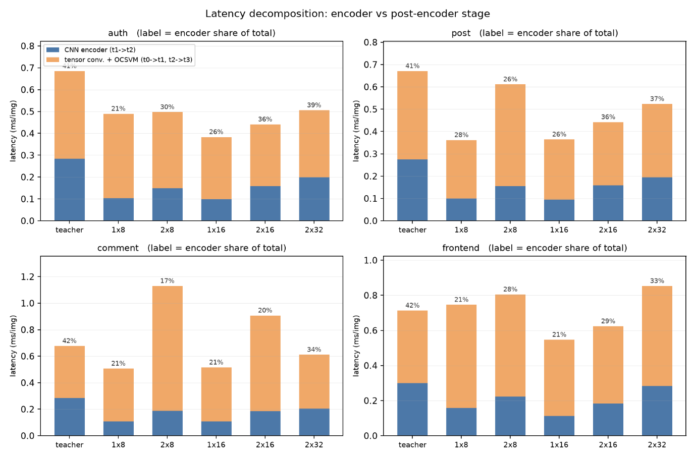

추론 지연에서 CNN 인코더가 차지하는 비중은 17%에서 42%에 그칩니다. 나머지는 텐서 변환과 OCSVM
판정이며, 의미 기반 표현의 이미지가 작아 인코더가 총 지연을 지배하지 않기 때문입니다. 파라미터를
키워도 전체 지연이 비례해서 늘지 않는 이유가 여기에 있습니다.

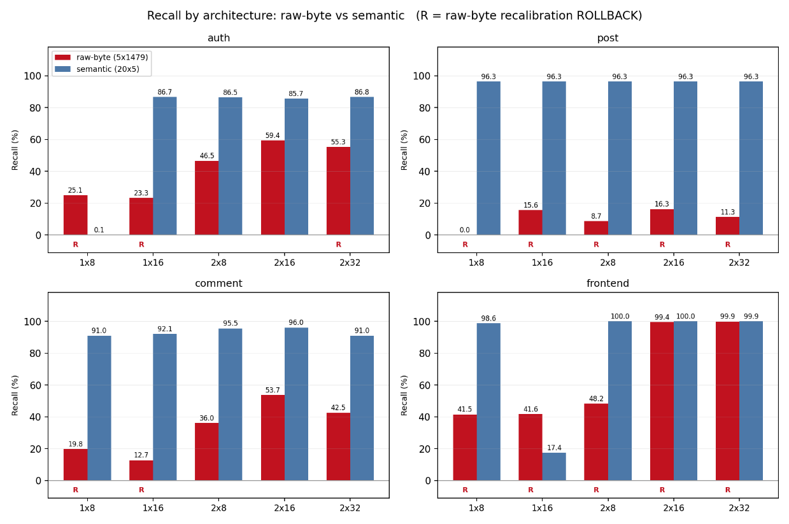

선행 연구의 원시 바이트 표현과 대조한 결과, raw-byte는 웹앱 계층 공격에서 탐지력이
붕괴했습니다. post는 다섯 구조 전부 Recall 16.27% 이하이고 ROC-AUC도 0.545에서 0.701로 무작위선에
근접해 정상과 공격을 순위로도 분리하지 못합니다. 같은 서비스에서 semantic은 다섯 구조 모두 Recall
96.29%, ROC-AUC 0.985 이상입니다. 이미지 크기는 74배 작고 추론 지연은 1.5배에서 5.4배 빠릅니다.

**한계.** payload 내부만 정상과 다른 공격은 탐지가 제한적입니다. l2는 정상 east-west 통신과의
차이가 Authorization 헤더의 토큰 값에만 있어 Recall이 8.79%에서 26.37%에 머뭅니다. cred_enum도
메서드, 엔드포인트, Content-Type이 정상 로그인과 모두 같아 40%에서 43% 수준입니다. 이는 CNN 성능의
문제가 아니라 표현의 정보 한계이며, 토큰 서명을 검증하는 별도 층위나 시간 축 누적 행위 정보의
확장이 필요합니다.

**시연 결과**

| 차단 (DROP) | 대체 (RELAY) |
|---|---|
| 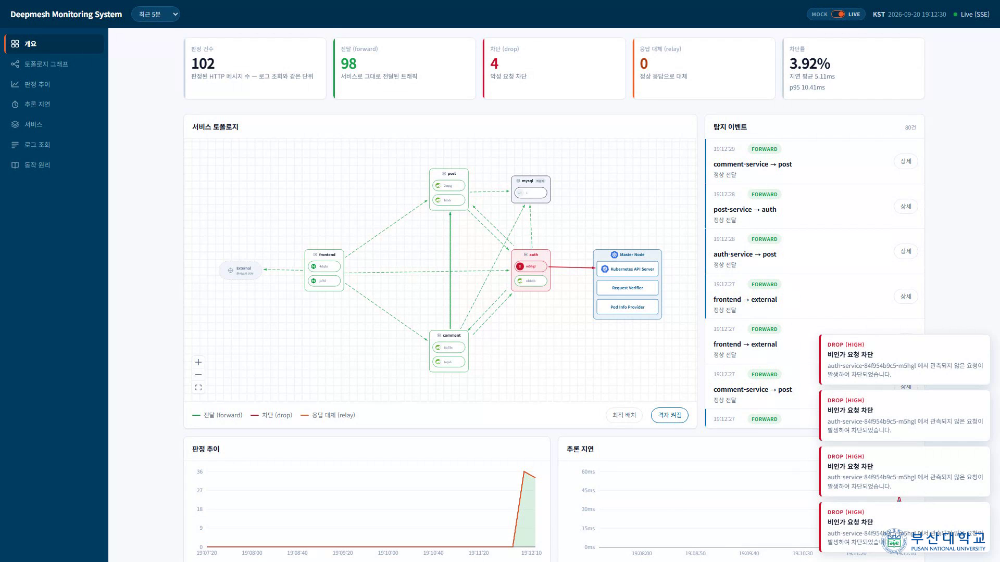 | 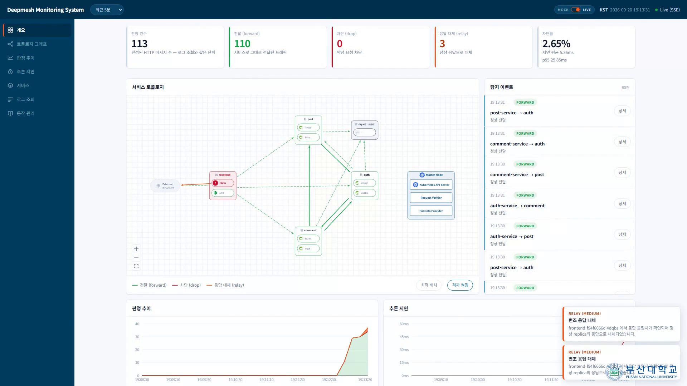 |
| k1 공격에서 auth가 쿠버네티스 API로 보내는 미관측 요청이 차단되고, 차단율과 판정 추이에 즉시 반영됩니다 | r1 공격에서 변조된 frontend 응답이 replica의 정상 응답으로 대체되고, 응답 대체 건수가 올라갑니다 |

#### 4.3. 디렉토리 구조

```
.
├── dashboard/                # 모니터링 대시보드
│   ├── backend/              # Spring Boot, SSE
│   └── frontend/             # React, React Flow
├── demo/
│   └── demo_run.sh           # 시연 스크립트
├── docs/                     # 제출 문서
│   ├── 01.보고서/            # 착수, 중간, 최종
│   ├── 02.포스터/
│   ├── 03.발표자료/
│   └── images/               # README 그림
├── infra/                    # 클러스터 구축 (Vagrant + KVM/libvirt)
│   ├── Vagrantfile           # 4노드 VM 정의
│   ├── scripts/common.sh     # 노드 공통 사전 설정
│   └── README.md             # 클러스터 환경 명세
├── k8s/                      # 쿠버네티스 매니페스트
│   ├── auth-service/         # 서비스별 Deployment (사이드카 주입본 포함)
│   ├── comment-service/
│   ├── dashboard/            # 대시보드 배포
│   ├── frontend/
│   ├── model/                # 탐지 모델 NFS PV, PVC
│   ├── mysql/
│   ├── no-sidecar/           # 무방어 상태 비교용
│   ├── post-service/
│   └── traffic-gen/          # 배경 트래픽 생성기
├── msa/                      # 실험 대상 MSA 게시판
│   ├── backend/              # auth, post, comment (Spring Boot)
│   ├── db/init.sql
│   └── frontend/             # React + Nginx
├── notebooks/                # 학습, 평가, 시연 노트북
├── servicemesh/              # 서비스메시 본체
│   ├── control-plane/        # Request Verifier, Pod Info Provider
│   └── data-plane/           # 사이드카 프록시
│       ├── detection/        # 추론 런타임
│       ├── model/            # 서비스별 배포 모델 가중치
│       └── traffic_handler/  # 인터셉트, 세션화, 판정 집행
└── training/                 # 학습 파이프라인
    ├── preprocess_semantic.py    # 의미 기반 이미지화
    ├── recalibrate_ocsvm.py      # OCSVM 재보정
    ├── student_cnn.py            # 학생 모델 정의
    ├── train_kd_pipeline.py      # 지식 증류 학습
    └── traffic/                  # 정상, 공격 트래픽 생성 스크립트
        ├── attack/inpod/         # 공격 시나리오
        ├── benign/               # Locust 기반 정상 시나리오
        └── capture/              # pcap 수집
```

#### 4.4. 산업체 멘토링 의견 및 반영 사항

산업체 멘토링으로 중간보고서에 대한 서면 자문을 받았습니다.

> 인라인 이상탐지 구조와 AI 경량화 설계가 뛰어남. 다양한 공격 시나리오에 대한 모델 검증 및 보강을
> 통해 실연동을 성공적으로 구현하기를 기대함

| 멘토 의견 | 대응 |
|---|---|
| 정상 트래픽과 유사한 난이도 높은 공격 시나리오를 추가할 것 | **반영.** 정상과 프로토콜, 엔드포인트가 같은 l2, l3, enum_seq, cred_enum, scan_seq 다섯 종을 추가하고 연속된 패킷 5개를 함께 보도록 표현을 바꿨습니다. payload 내부만 다른 l2와 cred_enum에서 탐지가 제한적이라는 표현의 한계도 함께 규명했습니다 |
| 서비스 수가 증가함에 따른 자원 오버헤드 최적화 방안이 필요함 | **반영.** 지식 증류로 Teacher 314.69K를 Student 1.23K에서 12.64K로 줄이고 CPU 전용 휠로 빌드해, GPU 없이 이미지당 0.36ms에서 1.13ms의 추론을 유지합니다.<br/>**향후.** 수집부터 재보정까지 흩어져 있는 스크립트를 하나의 파이프라인으로 묶으면, 서비스가 늘어날 때 드는 비용을 정상 시나리오 정의만으로 줄일 수 있습니다 |
| 차기 단계에 어떤 보완 모듈과 연계해 해결할지 확장성 측면을 추가할 것 | **향후.** 네트워크 정책이나 RBAC가 1차로 거르고 그 규칙으로 판단할 수 없는 트래픽만 학습 기반 탐지로 넘기는 계층 구성, 그리고 ReplicaSet이 3개 이상일 때 응답 다수결로 교차 검증을 확장하는 방안을 다음 단계로 잡았습니다 |

### 5. 설치 및 실행 방법

#### 5.1. 설치절차 및 실행 방법

**1단계. 클러스터 준비**

4노드 쿠버네티스 클러스터가 필요합니다. 노드 IP, 버전, CNI 등 맞춰야 할 값은
[infra/README.md](infra/README.md)에 정리되어 있습니다. `infra/Vagrantfile`로 VM을 만든 뒤
`kubeadm`으로 초기화합니다.

```bash
cd infra && vagrant up
```

**2단계. 탐지 모델 NFS export**

사이드카는 모델을 이미지에 굽지 않고 NFS로 마운트합니다. export 설정은
[k8s/model/README.md](k8s/model/README.md)를 따릅니다. 이 단계를 건너뛰면 사이드카 Pod이
`ContainerCreating`에서 멈춥니다.

**3단계. 매니페스트 적용**

```bash
kubectl apply -f k8s/namespace.yaml
cp k8s/secret.example.yaml k8s/secret.yaml   # 값을 채운 뒤
kubectl apply -f k8s/secret.yaml -f k8s/configmap.yaml
kubectl apply -f k8s/mysql/ -f k8s/model/
kubectl apply -f k8s/auth-service/ -f k8s/post-service/ -f k8s/comment-service/ -f k8s/frontend/
kubectl apply -f k8s/dashboard/ -f k8s/ingress.yaml
```

**4단계. Control Plane 기동**

Request Verifier와 Pod Info Provider는 쿠버네티스 리소스가 아니라 master 노드의 호스트
프로세스입니다. `kubectl get pods`에 나오지 않으므로 빠뜨리기 쉽습니다.

```bash
pip3 install -r servicemesh/control-plane/requirements.txt
python3 servicemesh/control-plane/control_plane.py
```

**접속 포트**

| 대상 | 포트 |
|---|---|
| MSA 게시판 | 30080 (NodePort) |
| 모니터링 대시보드 | 30090 (NodePort) |
| Control Plane API | 8080 (master 호스트) |

**시연**

```bash
bash demo/demo_run.sh live     # 배경 정상 트래픽 시작
bash demo/demo_run.sh k1       # K8s API 정찰 공격, DROP 확인
bash demo/demo_run.sh r1       # 응답 변조 공격, RELAY 확인
bash demo/demo_run.sh dash     # 대시보드 요약 출력
```

#### 5.2. 오류 발생 시 해결 방법

| 증상 | 원인과 해결 |
|---|---|
| 사이드카 Pod이 `ContainerCreating`에서 멈춤 | 모델 NFS export가 없거나 노드에 `nfs-common`이 없습니다. 2단계를 확인합니다 |
| worker가 `NotReady` | CNI가 올라오지 않았습니다. `kubectl -n kube-system get pods -o wide`로 해당 노드의 `calico-node`를 확인합니다 |
| 대시보드 토폴로지의 간선이 전부 external로 뭉침 | Pod 대역이 `10.244.0.0/16`과 어긋났습니다. 사이드카가 Pod IP로 상대 서비스를 역매핑하므로 대역이 맞아야 합니다 |
| 사이드카가 검증 없이 트래픽을 통과시킴 | Control Plane 호스트 프로세스가 떠 있는지, `CONTROL_PLANE_URL`이 맞는지 확인합니다 |
| `vagrant up`이 NFS 단계에서 멈춤 | 호스트에 `nfs-kernel-server`가 없거나 sudo 암호 입력을 기다리는 중입니다 |

### 6. 소개 자료 및 시연 영상

#### 6.1. 프로젝트 소개 자료

- [프로젝트 포스터](docs/02.포스터/2026포스터_42_DeepMesh.pdf)
- [최종보고서](docs/01.보고서/2026전기_최종보고서_42_DeepMesh_KD-CNN%20기반%20경량%20서비스메시를%20활용한%20클라우드%20네이티브%20침입탐지시스템%20설계%20및%20구현.pdf)
- [중간보고서](docs/01.보고서/2026전기_중간보고서_42_DeepMesh_KD-CNN%20기반%20경량%20서비스메시를%20활용한%20클라우드%20네이티브%20침입탐지%20시스템%20설계%20및%20구현.pdf)
- [착수보고서](docs/01.보고서/2026전기_착수보고서_42_DeepMesh_KD-CNN%20기반%20경량%20서비스메시를%20활용한%20클라우드%20네이티브%20침입탐지%20시스템%20설계%20및%20구현.pdf)

<!-- TODO: 최종 발표자료가 완성되면 docs/03.발표자료/ 에 넣고 링크를 추가합니다. -->

#### 6.2. 시연 영상

[](https://www.youtube.com/watch?v=3nPXqj4ZAXo)

### 7. 팀 구성

#### 7.1. 팀원별 소개 및 역할 분담

| 팀원 | 이메일 | 역할 |
|:---:|:---:|---|
| <p align="center"><a href="https://github.com/mini-apple"></a><br/><a href="https://github.com/mini-apple"><strong>신⁠의⁠철</strong></a></p> | suc2150@pusan.ac.kr | MSA ERD 작성과 endpoint 설계, Auth 서비스 개발, K8s 클러스터 구축, Control Plane 개발, 대시보드 endpoint 설계와 프론트엔드 개발 |
| <p align="center"><a href="https://github.com/Kimgooner"></a><br/><a href="https://github.com/Kimgooner"><strong>정⁠의⁠진</strong></a></p> | ppvws@pusan.ac.kr | MSA 게시판 프론트엔드 개발, K8s 배포 파일 작성, iptables와 Traffic Handler 개발, 대시보드 ERD 작성과 백엔드 개발, 전체 통합 배포와 end to end 테스트 |
| <p align="center"><a href="https://github.com/nnhhlee">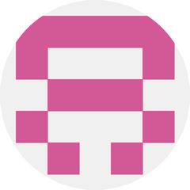</a><br/><a href="https://github.com/nnhhlee"><strong>이⁠시⁠하</strong></a></p> | siiihhaaa@pusan.ac.kr | MSA Post와 Comment 개발, 트래픽 데이터 수집, Traffic Converter 제안과 구현, 공격 시나리오 추가, KD-CNN과 OCSVM 학습 및 스윕 테스트 |

지도교수: 최윤호

#### 7.2. 팀원 별 참여 후기

| 팀원 | 참여 후기 |
|:---:|---|
| <p align="center"><a href="https://github.com/mini-apple"></a><br/><a href="https://github.com/mini-apple"><strong>신⁠의⁠철</strong></a></p> | 테스트베드 구현부터 서비스메시, 대시보드까지 대규모 프로젝트 전반을 총괄하며 단계마다 정해진 일정에 맞춰 개발을 진척시키고 회의를 주도하는 Project Management를 경험했습니다. 그 과정에서 구현 자체보다도 설계 명세를 정확히 작성하고, 결과를 잘 정리해 문서화하는 것이 더 중요하다고 느꼈습니다. 무엇보다 팀원들의 뛰어난 역량과 책임감, 배려심 덕분에 졸업과제를 잘 마무리할 수 있었다고 생각합니다. |
| <p align="center"><a href="https://github.com/Kimgooner"></a><br/><a href="https://github.com/Kimgooner"><strong>정⁠의⁠진</strong></a></p> | <!-- 작성 예정 --> |
| <p align="center"><a href="https://github.com/nnhhlee"></a><br/><a href="https://github.com/nnhhlee"><strong>이⁠시⁠하</strong></a></p> | <!-- 작성 예정 --> |

### 8. 참고 문헌 및 출처

[1] Palo Alto Networks Unit 42, "Understanding Current Threats to Kubernetes Environments," 2026. [Online]. Available: https://unit42.paloaltonetworks.com/modern-kubernetes-threats

[2] Aqua Team, "Istio Security: Zero-Trust Networking," Aqua Security, Dec. 10, 2018. [Online]. Available: https://blog.aquasec.com/istio-kubernetes-security-zero-trust-networking

[3] Flynn, "Workshop Recap: A Deep Dive into Kubernetes mTLS with Linkerd," Linkerd, Jan. 30, 2023. [Online]. Available: https://linkerd.io/2023/01/30/mtls-and-linkerd/

[4] T. Chen, S. Kornblith, M. Norouzi, and G. Hinton, "A Simple Framework for Contrastive Learning of Visual Representations," in Proc. 37th Int. Conf. Machine Learning (ICML), pp. 1597-1607, 2020.

[5] Y. LeCun, L. Bottou, Y. Bengio, and P. Haffner, "Gradient-Based Learning Applied to Document Recognition," Proceedings of the IEEE, vol. 86, no. 11, pp. 2278-2324, 1998.

[6] G. Hinton, O. Vinyals, and J. Dean, "Distilling the Knowledge in a Neural Network," arXiv preprint arXiv:1503.02531, 2015.

[7] B. Schölkopf, J. C. Platt, J. Shawe-Taylor, A. J. Smola, and R. C. Williamson, "Estimating the Support of a High-Dimensional Distribution," Neural Computation, vol. 13, no. 7, pp. 1443-1471, 2001.

[8] G. Yoon, J.-S. Kim, S. Kim, J. Jeong, M. Pratiwi, and Y.-H. Choi, "Lightweight Service Mesh for Intrusion Detection using KD-CNN in Cloud-Native Environments," in Proc. 2025 Cloud Computing Security Workshop (CCSW '25), ACM, 2025.

[9] B. E. Strom, A. Applebaum, et al., "MITRE ATT&CK: Design and Philosophy," The MITRE Corporation, Technical Report MP180360R1, 2020.

[10] G. Yoon, J. Shin, J.-S. Kim, S. Kim, J. Jeong, and Y.-H. Choi, "Container-Specific Service Mesh-Based System for Mitigating Lateral Movement Attacks," IEEE Transactions on Cloud Computing, vol. 14, no. 1, pp. 92-109, 2026.
